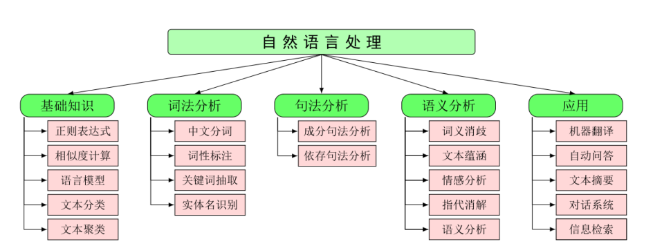

|任务名 |参考资料 |完成情况|
| :-- | :-- | :---|
| 正则表达式 | 复旦NLP实验课Homework 1| |
| 拼写检查 | 复旦大数据学院Homework 1| |
| 文本关键词提取 |计科NLP课程实验一，基于TextRank提取关键词 | |
| 基于机器学习的文本分类 |复旦NLP-Beginer任务一, 神经网络与深度学习前3章练习题，李宏毅机器学习前2个作业，复旦NLP课程线性分类实验，复旦大数据学院股票预测，计科NLP课程实验二 |  |
|基于神经网络的语言模型 |复旦NLP-Beginer，李宏毅17年深度学习任务1，复旦大数据学院期末作业1,CS224N前2个作业，大数据NLP第4个作业，复旦NLP实现ESA、LSA算法,神经网络与深度学习4-6章练习题，计科NLP课程实验三词的语义相似度计算|  |
|基于深度学习的文本分类 |复旦NLP-Beginer任务二，复旦NLP文本分类任务，李宏毅18年深度学习任务一，周昉老师实验室[任务](https://github.com/brightmart/text_classification)，复旦PRML使用FastNLP，李宏毅机器学习作业3、6，计科NLP课程实验五文本情感分析|  |
|文本聚类 |计科NLP课程实验二，李宏毅机器学习实验7 |  |
|基于注意力机制的文本匹配 |复旦NLP-Beginer |  |
|实体识别 |复旦NLP-Beginer基于LSTM+CRF的序列标注，东南大学知识图谱课程 | | |
|关系抽取 |计科NLP课程实验四，东南大学知识图谱课程 |  |
|事件抽取 | 复旦大数据学院作业三，东南大学知识图谱课程|  |
|依存句法分析 |CS224N任务三 | |
|成分句法分析 | | |
|自动问答 |CS224N期末作业 |  |
|机器翻译 |CS224N实验4、5 | |
|文本生成 |复旦PRML生成唐诗 |   |
|Seq2Seq |李宏毅深度学习实验2，李宏毅深度学习17实验2 |  |
|深度生成网络 |李宏毅深度学习实验3（17年18年），神经网络与深度学习实验11、12，复旦PRML非参数估计 |   |
|强化学习|神经网络与深度学习14，李宏毅深度学习实验4（17，18） |    |
|模型解释|李宏毅机器学习实验4 |    |
|模型攻击 |李宏毅机器学习实验5 | |
|模型压缩 |李宏毅深度学习实验8 | |
|其他项目 |复旦大数据学院NLP期末实验，李宏毅深度学习17年期末作业 |   |

-------------------------------------------------

Labs in the NLP course COMS0031132095
- [x] Keywords Extraction using TF-IDF Algorithm
- [x] Supervised Chinese Text Classification
- [x] Word segmentation and POS tagging based on HMM algorithm (hw1)
- [x] Text Clustering
- [ ] Semantic Similarity Calculation of Chinese Words (Word2Vec)
- [ ] Entity Relationship Extraction
- [ ] Text Sentiment Analysis

# REFERENCES

**NLP入门**
- [Bag of Words Meets Bags of Popcorn](https://www.kaggle.com/c/word2vec-nlp-tutorial)
- [复旦大学邱锡鹏教授：词法、句法分析研究进展综述（2019年5月1日）](https://mp.weixin.qq.com/s/AP4TCnRfIccqAxDu4FlBew)
- [A Summary of Constituent Parsing](https://godweiyang.com/2018/09/26/constituent-parsing-summary/)&emsp;[递归神经网络](https://zybuluo.com/hanbingtao/note/626300)
- [NLP-Beginner：自然语言处理入门练习](https://github.com/SimpleLP/nlp-beginner)

**基础内容**
- [CS224N](http://web.stanford.edu/class/cs224n/index.html)
- [Natural Language Processing Slides, 2012](https://web.stanford.edu/~jurafsky/NLPCourseraSlides.html?utm_source=wechat_session&utm_medium=social&utm_oi=844207196790202368), [Video](https://www.bilibili.com/video/av35805262?from=search&seid=16460359899435869094)
- [Speech and Language Processing](https://web.stanford.edu/~jurafsky/slp3/), Dan Jurafsky and James H. Martin.
- [Algorithms for NLP, CMU](http://demo.clab.cs.cmu.edu/11711fa18/)
- [Natural Language Processing](https://github.com/jacobeisenstein/gt-nlp-class/blob/master/notes/eisenstein-nlp-notes.pdf), Jacob Eisenstein.
- [A Primer on Neural Network Models for Natural Language Processing](http://u.cs.biu.ac.il/~yogo/nnlp.pdf), Yoav Goldberg.
- [CS224U Natural Language Understanding](https://web.stanford.edu/class/cs224u/)
- [COMS W4705: Natural Language Processing](http://www.cs.columbia.edu/~mcollins/cs4705-spring2019/)

**附加材料**
- [如何写一篇合格的NLP论文](https://zhuanlan.zhihu.com/p/58752815)
- [香侬科技李纪为：初入NLP领域的一些小建议](https://cloud.tencent.com/developer/article/1421774)
- [NLP@FUDAN DATA](http://www.sdspeople.fudan.edu.cn/zywei/DATA130006/index.html)&emsp;[[CODE](https://github.com/Rshcaroline/FDU-Natural-Language-Processing)]
- [NLP@FUDAN CS](https://textprocessing.github.io/)
- [601.465/665: Natural Language Processing](https://www.cs.jhu.edu/~jason/465/)
- [DL&NLP@Oxford ×DeepMind](https://edu.aliyun.com/course/844?utm_content=m_44346)&emsp;[[GitHub](https://github.com/oxford-cs-deepnlp-2017/lectures)]
- [Foundations of Statistical Natural Language Processing](https://nlp.stanford.edu/fsnlp/)
- 统计自然语言处理（第二版），宗成庆著

-----------------------------------------------------------------------------------------

This page maintained by @ <a href="https://dasepeng.github.io/">DaSEPeng</a>, 	
<a href="https://github.com/DaSEPeng/Natural-Language-Processing/">View on GitHub</a>

