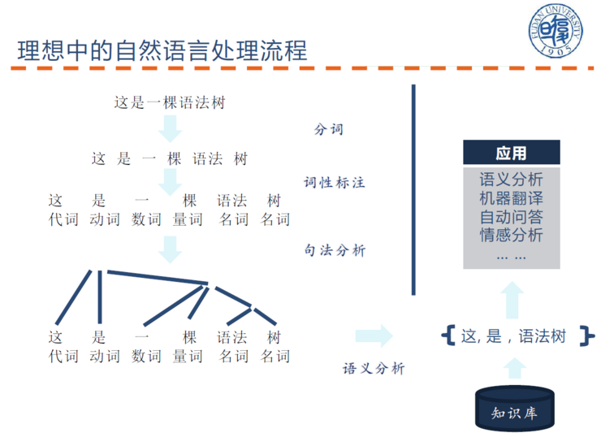

**BIG PICTURE**  

# 1. COURSE INFOMATION
- LECTURER
	- [Chris Manning](https://nlp.stanford.edu/~manning/)
- HOMEPAGE
	- [CS224N](http://web.stanford.edu/class/cs224n/index.html)
- VIDEO
	- [BILIBILI](https://www.bilibili.com/video/av46216519/)

# 2. NOTES AND PROJECTS

**COURSE NOTES AND PROJECTS**

| NUM|DATE |  CONTENT      |    NOTES | PROJECT  |
| :-----|:--| :-------- | :--------| :-- |
|1 |2019/03/24|Introduction to NLP and Word2Vec   |  |     |

**FINAL PROJECT**
- DUE

# 3. OTHER REFERENCES
- [NLP@FUDAN DATA](http://www.sdspeople.fudan.edu.cn/zywei/DATA130006/index.html)&emsp;[[CODE](https://github.com/Rshcaroline/FDU-Natural-Language-Processing)]
- [NLP@FUDAN CS](https://textprocessing.github.io/)
- [Foundations of Statistical Natural Language Processing](https://nlp.stanford.edu/fsnlp/)
- [CS 124: From Languages to Information](https://web.stanford.edu/class/cs124/)
- [CS 276 / LING 286: Information Retrieval and Web Search](http://web.stanford.edu/class/cs276/)
- [601.465/665: Natural Language Processing](https://www.cs.jhu.edu/~jason/465/)
- [COMS W4705: Natural Language Processing](http://www.cs.columbia.edu/~mcollins/cs4705-spring2019/)
- [DL&NLP@Oxford ×DeepMind](https://edu.aliyun.com/course/844?utm_content=m_44346)&emsp;[[GitHub](https://github.com/oxford-cs-deepnlp-2017/lectures)]

$$[View on GitHub](https://github.com/SimpleLP/Natural-Language-Processing/)$$

